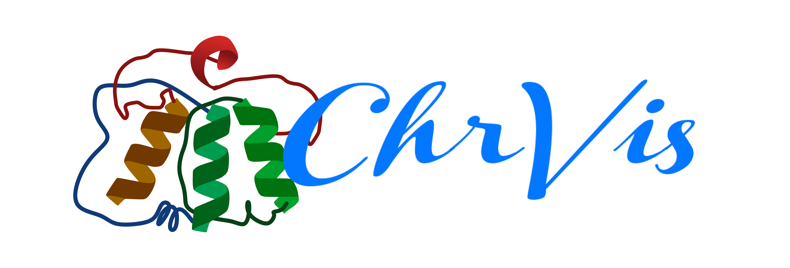
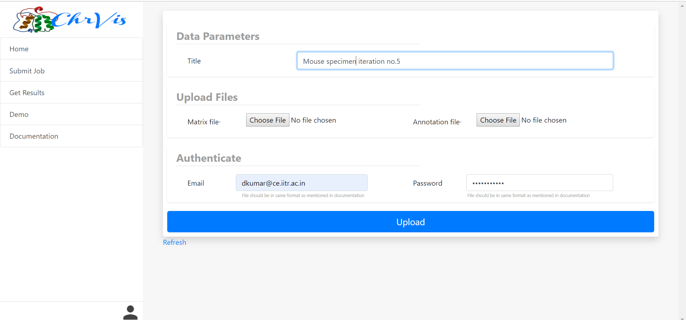

<!-- PROJECT SHIELDS -->
[![Build Status][build-shield]]()
[![Contributors][contributors-shield]]()
[![MIT License][license-shield]][license-url]
[![LinkedIn][linkedin-shield]][linkedin-url]


<br />
<p align="center">
  <a href="https://github.com/othneildrew/Best-README-Template">
    
  </a>

  <h3 align="center">ChrVis</h3>

  <p align="center">
    Visualize your genome and analyse it :heart:
    <br />
    <br />
    <a href="https://orionpax00.github.io/ChrVis">View Demo</a>
    ·
    <a href="https://docs.google.com/document/d/13Xhju3PasUX4BQvZz-5Pi3nGKWL0ua7XiWhLqd7fJMI/edit?usp=sharing">Documentation</a>
    ·
    <a href="https://github.com/orionpax00/ChrVis/issues">Report Bug</a>
    ·
    <a href="https://github.com/orionpax00/ChrVis/issues">Request Feature</a>
  </p>
</p>


<!-- TABLE OF CONTENTS -->
## Table of Contents

* [About the Project](#about-the-project)
  * [Built With](#built-with)
* [Getting Started](#getting-started)
  * [Prerequisites](#prerequisites)
  * [Installation](#installation)
* [Contributing](#contributing)
* [License](#license)
* [Contact](#contact)
* [Acknowledgements](#acknowledgements)


<!-- ABOUT THE PROJECT -->
## About The Project
<p align="center">
  
</p>

ChrVis is web suite to analyse and Visualize HiC data with a simple to use and elegant user interface and workflow.

### Built With
Completely with Python and Javascript and it's supporting libraries worth mentioning libraries and frameworks:
* [Python](https://python.com)
* [Javascript](https://python.com)


<!-- GETTING STARTED -->
## Getting Started
Follow the given commands and documentation to make run Dhadkan mobile app on to your local machine.

### Prerequisites
* Python 3.7 or above
* WebGL enabled web browser
* Docker

### Installation
#### Docker

```sh
git clone https:\\github.com\orionpax00\chrvis.git
```
```sh
cd chrvis
```
```sh
docker-compose build
```
```sh
docker exec -it chrvis bash
```

```sh
cd chrvis-server/
```
```sh
celery -A chrvis worker -l info
```

<!-- CONTRIBUTING -->
## Contributing

Contributions are what make the open source community such an amazing place to be learn, inspire, and create. Any contributions you make are **greatly appreciated**.

1. Fork the Project
2. Create your Feature Branch (`git checkout -b feature/AmazingFeature`)
3. Commit your Changes (`git commit -m 'Add some AmazingFeature`)
4. Push to the Branch (`git push origin feature/AmazingFeature`)
5. Open a Pull Request


<!-- LICENSE -->
## License

Distributed under the Apache License. See `LICENSE` for more information.


<!-- CONTACT -->
## Contact

Durgesh Kumar  - dkumar@ce.iitr.ac.in

Project Link: [https://github.com/orionpax00/ChrVis](https://github.com/orionpax00/ChrVis)


<!-- ACKNOWLEDGEMENTS -->
## Acknowledgements
* [Python](https://facebook.github.io/react-native/)
* [Javascript](https://facebook.github.io/react-native/)
* [Threejs](https://facebook.github.io/react-native/)
* [Sigmajs](https://facebook.github.io/react-native/)
* [Django](https://facebook.github.io/react-native/)
* [Networkx](https://facebook.github.io/react-native/)
* [TadBit](https://facebook.github.io/react-native/)

<!-- MARKDOWN LINKS & IMAGES -->
[build-shield]: https://img.shields.io/badge/build-passing-brightgreen.svg?style=flat-square
[contributors-shield]: https://img.shields.io/badge/contributors-2-orange.svg?style=flat-square
[license-shield]: https://img.shields.io/badge/license-apache-blue.svg?style=flat-square
[license-url]: https://github.com/shreya2feb/dhadkan_v3_mobile/blob/master/LICENSE
[linkedin-shield]: https://img.shields.io/badge/-LinkedIn-black.svg?style=flat-square&logo=linkedin&colorB=555
[linkedin-url]: https://www.linkedin.com/in/durgesh-kumar-807233157/
